# SQLAlchemy: "sqlite3.OperationalError: database is locked"

## 错误呈现

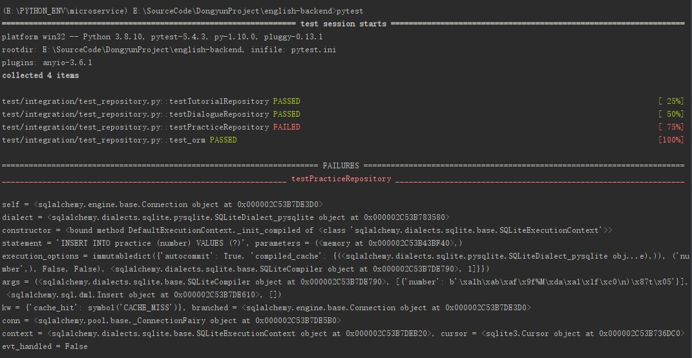

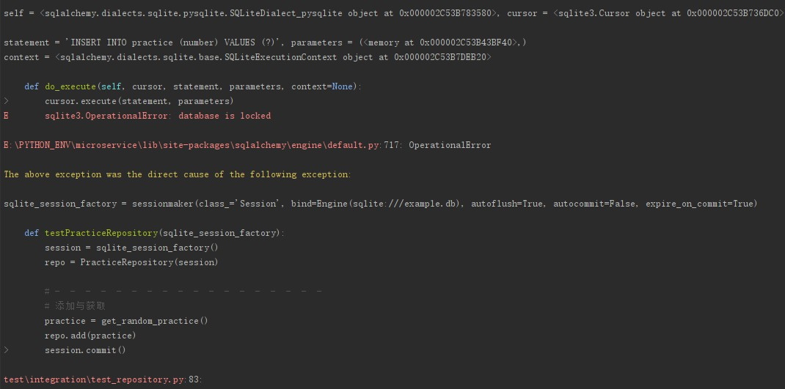

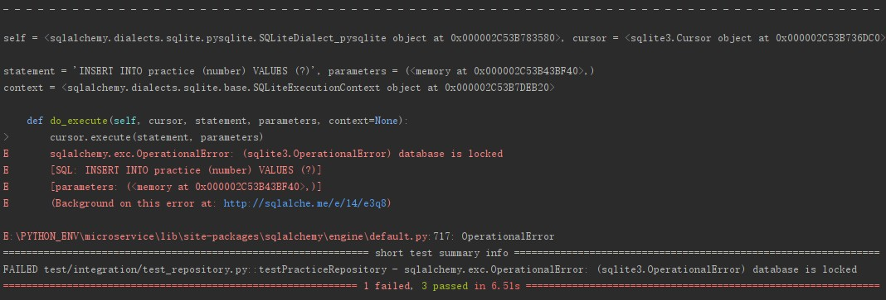

## 尝试解决

1. 怀疑是其它测试导致数据库锁表，所以跳过其它测试用例

	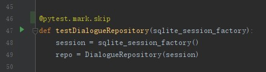

	原本错误的测试居然通过了

	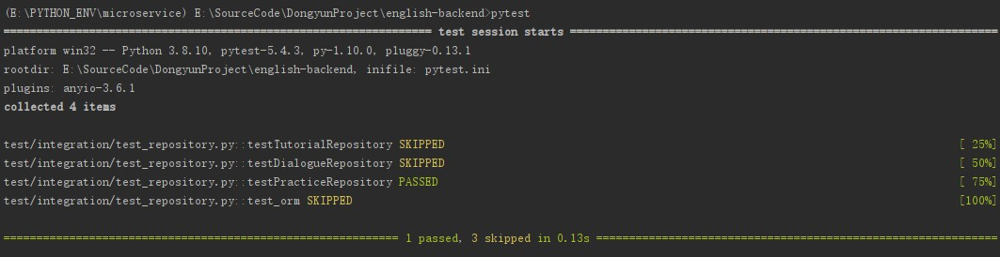

2. 随便再加载一个测试用例

	看到测试又失败了

	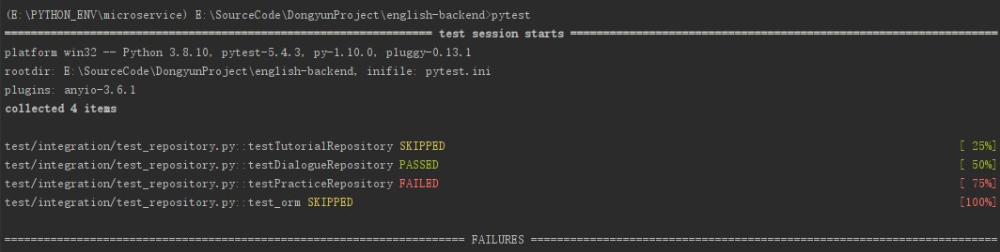

3. 想起错误之前的改动
   1. 即将sqlite内存数据库改成了文件数据库
	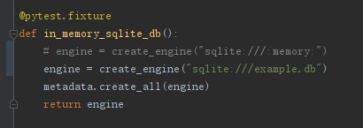
   2. . 将数据库的id（number）从String(32)改为了BINARY(16)，来压缩存储空间
	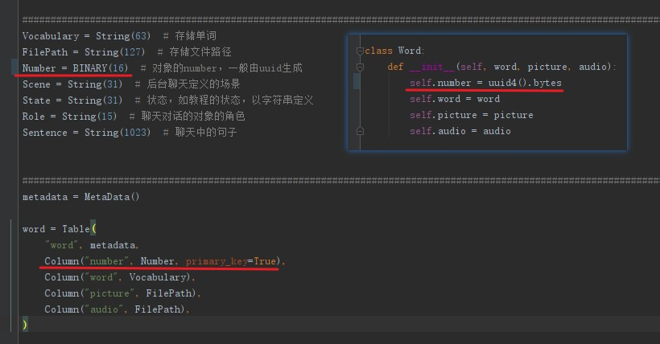

	现将原本的数据库删除，再运行一次测试

	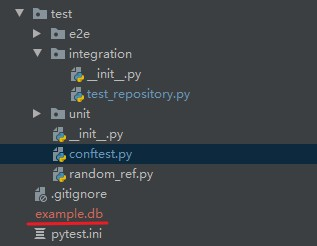

	测试又可以通过了

	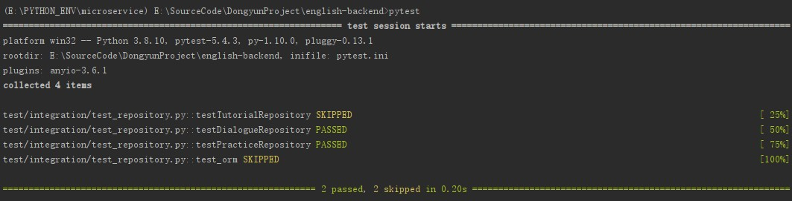

4. 运行所有测试

	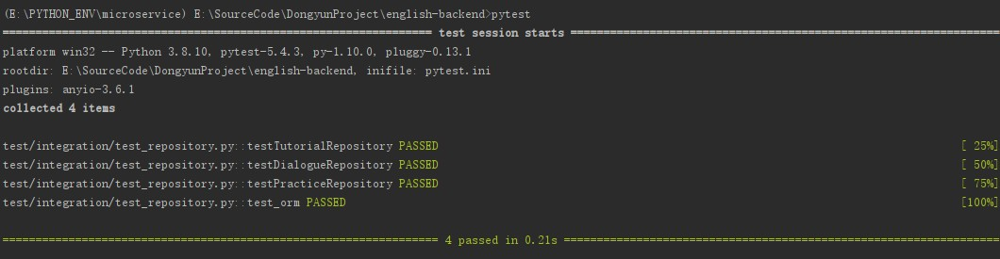

## 总结

1. sqlite的内存模式不能够看出所有的问题。这个bug的产生是因为不放心仅仅用内存数据库进行测试。而pycharm能够直接看到sqlite数据库文件里面的情况，所以使用文件模式也可以更好的观察到问题。目前有发现到了一个bug，将会在下一篇文章中尝试解决
2. 这个bug不是完全没学到东西。能够看出，在sqlite和sqlalchemy同时使用的情况下，当数据库的schema发生的修改，报出的错误竟然是数据库锁表
