# 重新生成session测试

## 目的描述

在sqlite文件数据库里面并没有看到数据，验证是否数据真的存入了数据库

## 修改过程描述

1. 重新申请一个session，接着申请新的repo

	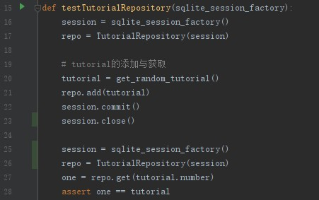

	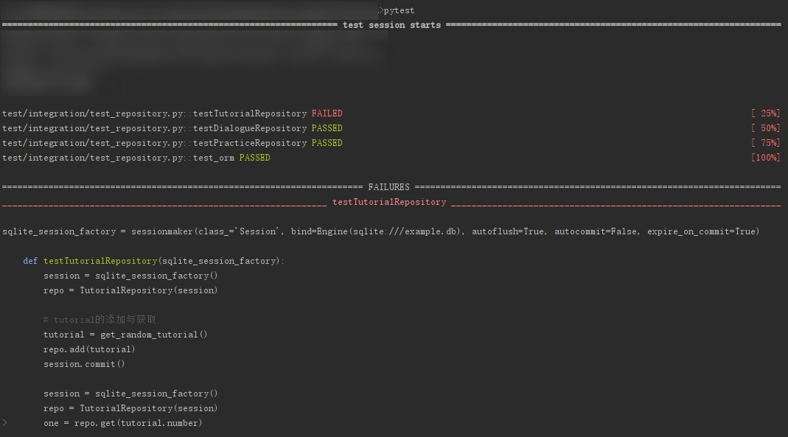

	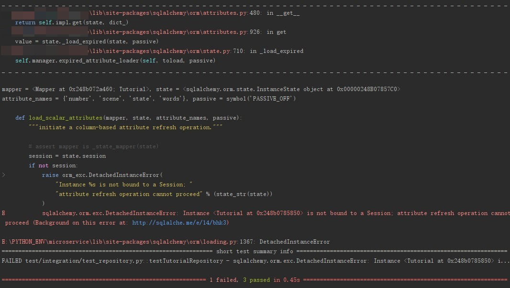
	
2. 看到"is not bound to session"，我理解为tutorial在add进database的时候，被进行了改造，让其保持与session的连接。当session被关闭的时候，tutorial也就无法使用了

	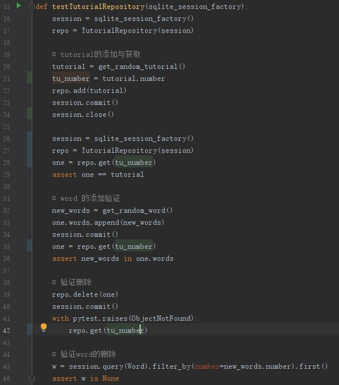
	
3. 修改了之后，bug变了，我以为是没有实现equal方法的原因，便给所有的类添加了equal方法

	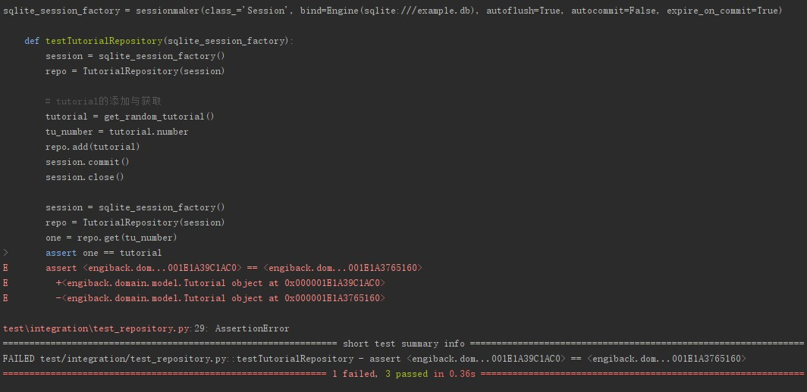

	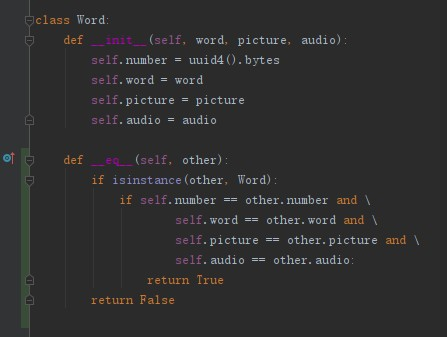

	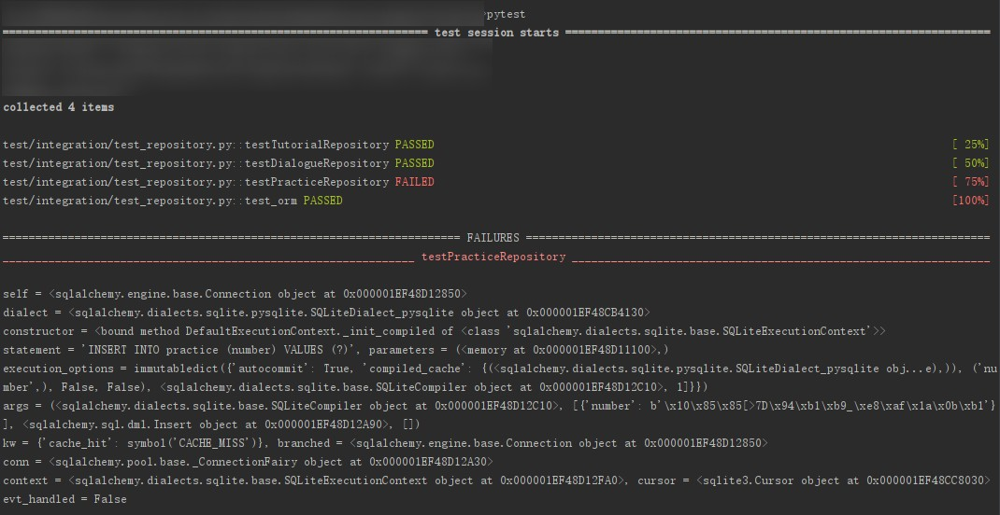
	
4. 添加了相等方法后，竟然又显示database locked。这个问题之前处理过，那次是修改了schema，但是数据库文件没有同步被修改，删除掉测试数据库，这个bug就消失了。这次我对上次的结论产生了怀疑。我猜测是不同的测试之前互相干扰导致的。但是不同的测试之间是顺序执行而不是并发执行的。这时我猜测是因为上一次执行完毕之后，数据库的session没有被正确关闭导致的

	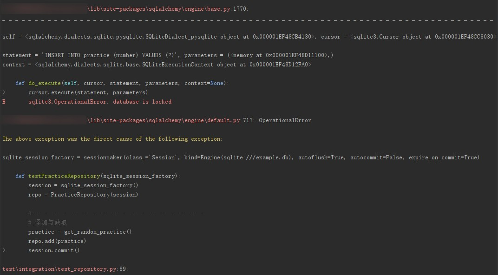

	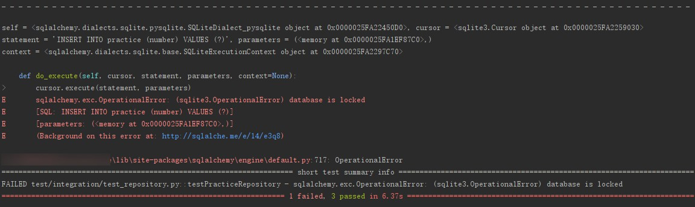

	每个测试的最后添加session关闭的代码
	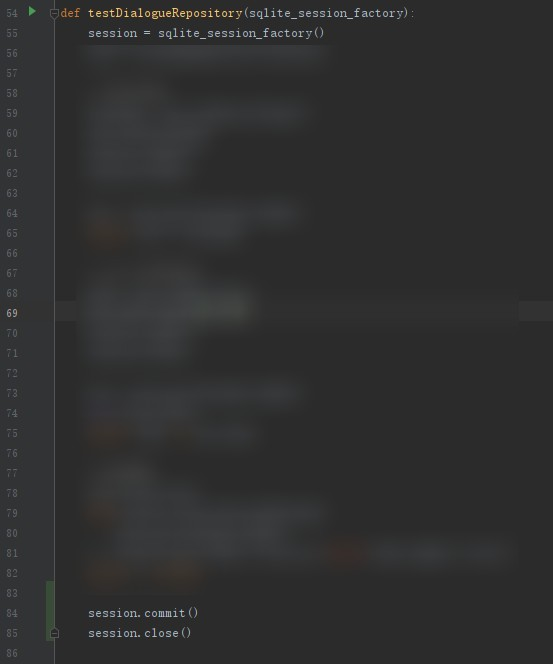

	这里显示所有测试是通过了的，但是这是把这次新增的测试注释掉了的结果
	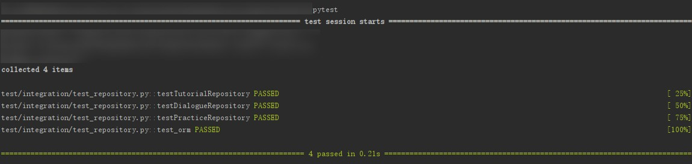
	
5. 添加回代码之后，出现了断开连接的错误

    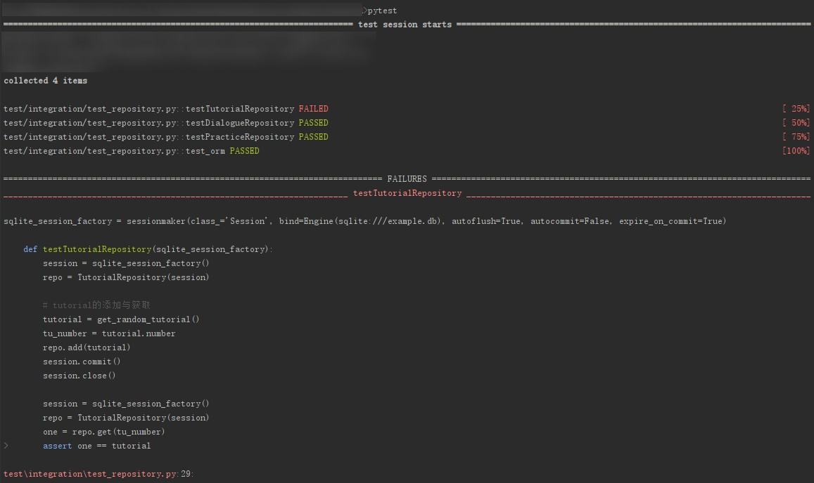

    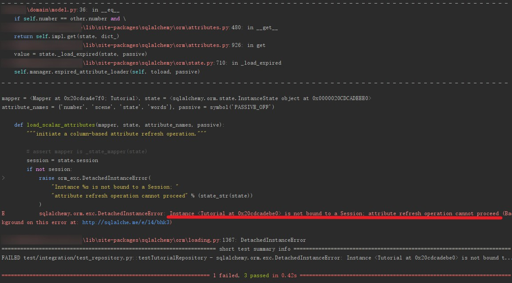
    
6. 获取到随机对象后，使用copy.deepcopy复制，复制品拿去添加到数据库：这样可以避免session. Add的时候原始对象被修改

    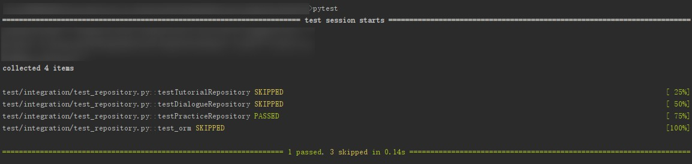

    

    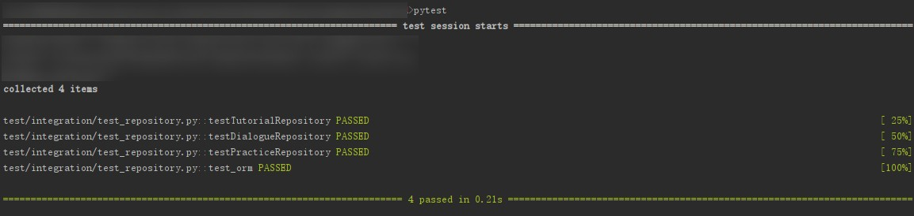

## 总结

1. 如果之前的bug使用某种方式修复了，不一定是因为解决了导致这个bug的原因，而是修改了bug触发条件中的某个，这样使得bug无法再触发，但是bug的源头可能依然是存在的
2. session没有正确关闭，导致database被锁死。查看了之前的项目，在所有的项目的最后，都没有发现session.close代码，说明这个锁死还有某些触发条件没有查明
