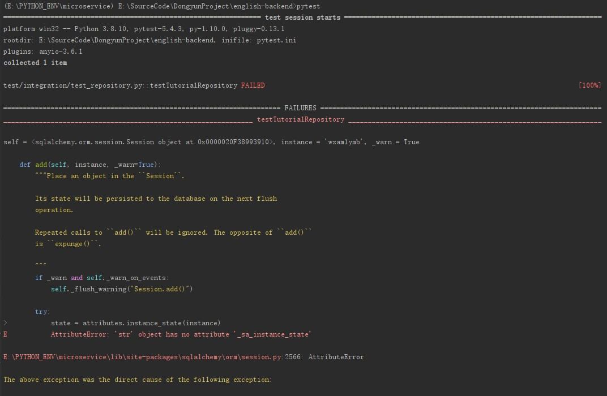
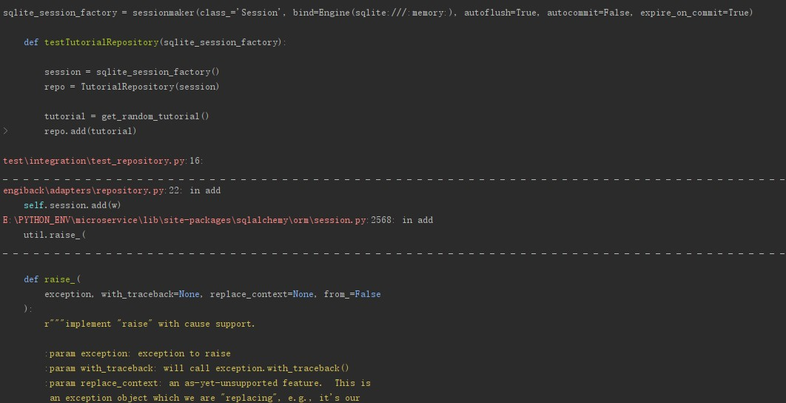
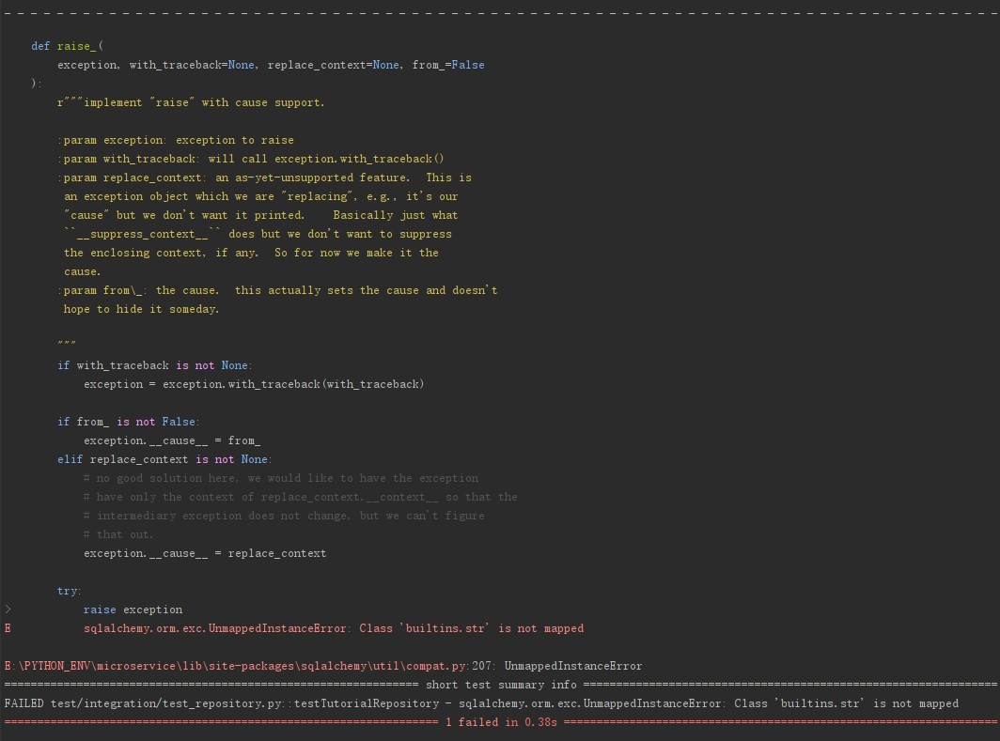
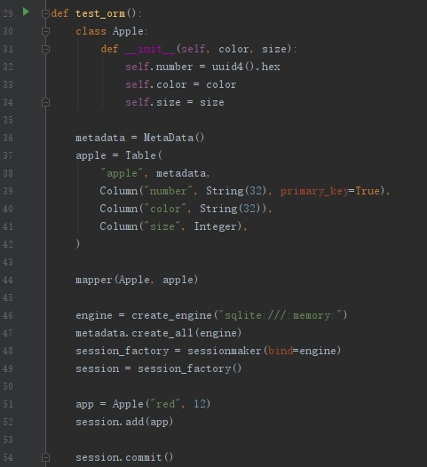
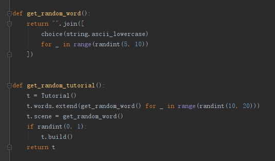
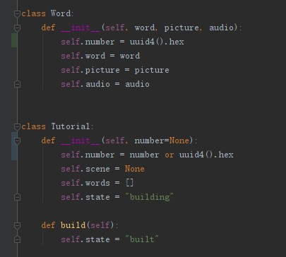
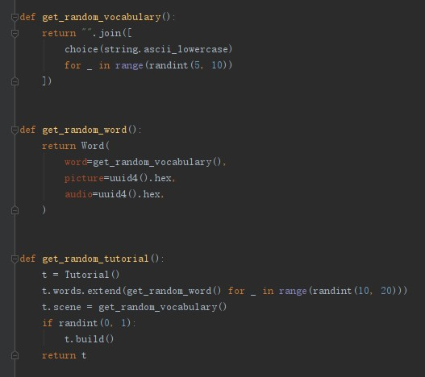

# SQLAlchemy: "AttributeError: 'str' object has no attribute '_sa_instance_state' "

## 出现问题

问题如下所示，SQLAlchemy提示报错，使用了为映射的类型，str

## 寻找问题

我自己是很疑惑的，因为我是用的类都是映射过了，为什么会出现这个报错呢？

我的第一反应是我是用映射的流程有错，是不是漏了某一步

所以我编写了一个简单的只有orm映射的测试样例，如下所示：

验证到流程没有出错，我想到了，很可能是测试样例的生成有问题

这里果然发现了问题

1. 在这个项目中Word是一个python类

2. 同时word本身也指示普通的单词，可以用str来表示

## 解决方案

1. 在一个类可能和普通概念重合的时候需要命名分开
2. 例如：可以使用get_random_word_string 和 get_random_word_class 切分两者
3. 关键是，需要时刻关注项目中的那些类名是和普通概念的名称是重合的

我这里才去的方案是，多使用一个vocabulary的概念

