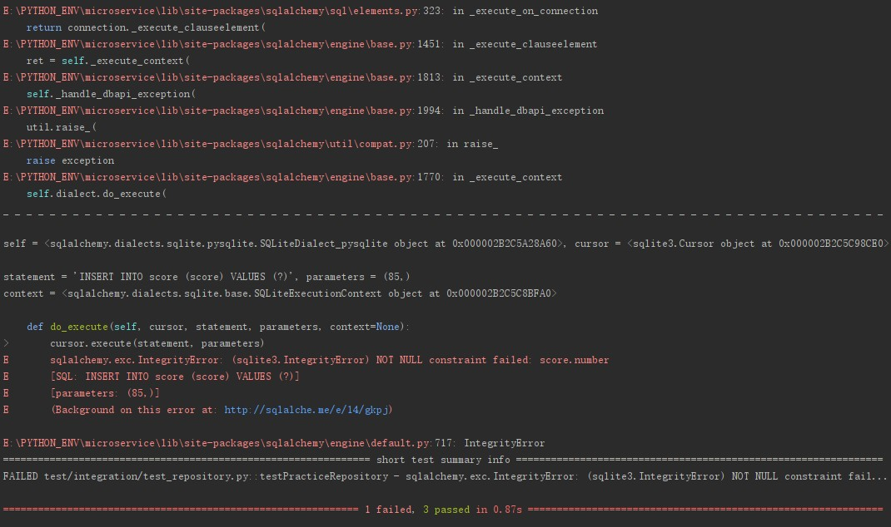
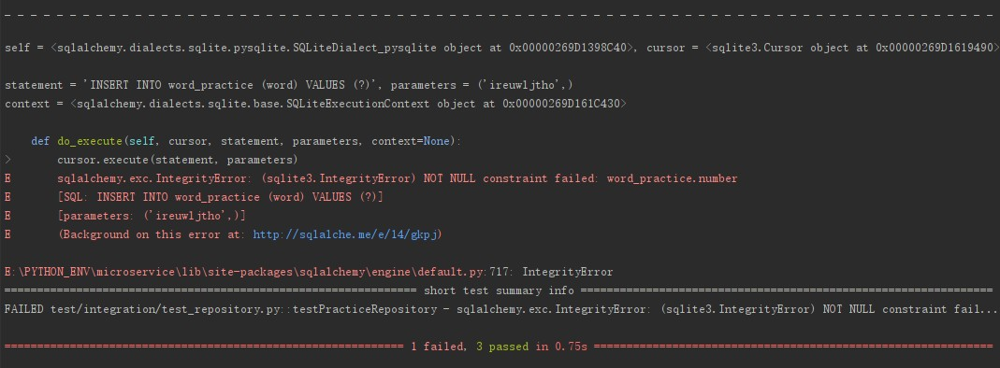
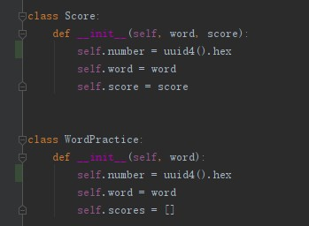

# SQLAlchemy: "sqlalchemy.exc.IntegrityError: (sqlite3.IntegrityError) NOT NULL constraint failed: word_practice.number"

## bug修复过程

如下所示，找不到score.number，导致数据库插入失败

修复了score.number之后，又出现了word_practice.number的问题

## 修复

## 复盘

这个的修复很显而易见，但是想复盘一下为什么会出现这个bug

1. 因为number缺失，导致了插入失败
2. 因为数据库的表关联，所以需要需要有关联的id
3. 在一对多的映射中，要么把父表的id放在子表上，要么建立专门的关系表。这两种情况，都需要子表有专属id
4. 但是在没有数据库关联的最初的模型编写过程中，没有id是很正常的
5. 在加入数据库逻辑之后，很容易把id只加到了父表上，而子表、孙表都没有加入id

其实在这里还有一个情况可以看到

1. 原本的word内部有一个score数组
2. 但是在orm的时候，原生的int类型无法直接映射
3. 所以需要建立一个Score类型对象，而对象内部有用的成员就只有score
4. 这个也是数据库逻辑侵入导致的