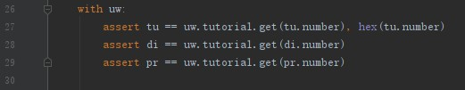
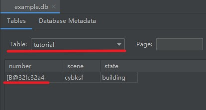

# SQLAlchemy：ObjectNotFound


1. 遇到异常
	pytest的异常内容
	
	异常所在的测试代码片段
	

2. 异常所测代码，添加number的hex显示
	
	测试结果
	
	发现没有办法和pycharm中db的数据进行直接比对
	

3. 删除example.db，清空数据库，重新进行测试
	uw文件
	
	测试
	
	发现对不上，但是不清楚是不是sqlite存储数据的显示问题还是别的什么
	

4. 使用底层语句进行测试
	
	底层语句的校验没有问题，确实可以找到对象，但是tu对象的number和查询的number无法对上
	

5. 只运行之前的测试
	

6. 察觉到uw的session获取方式是和之前测试中生成的方式不一样
	
	但是修改后，pytest报错没有任何改变

7. 将之前的测试一部分迁移过来
	
	测试居然通过了
	

8. 将迁移过来的注释掉
	

9. 删除掉迁移代码，并且只保留tutorial
	

10. 找到bug源头
	源头
	
	修改
	
	测试
	


## 总结

1. 没有看清楚，ObjectNotFound对应的语句是
   ```python
   assert di == uw.tutorial.get(di.number)
   ```

2. 没有一开始简化测试，限定其能够出bug的范围，让一开始的搜索范围就很大。在这个bug中体现的是， 一开始就测试了tutorial、dialogue和practice。过大的测试范围，让错误更加难找

3. 以后要注意这种复制粘贴的测试代码。特别是，那些排列整齐的部分，因为测试不应该有太多的相似之处

   如果不是太长，可以手敲，手敲的时候会应该会比复制粘贴过更多脑子

   ```python
   assert tu == uw.tutorial.get(tu.number)
   assert di == uw.tutorial.get(di.number)
   assert pr == uw.tutorial.get(pr.number)
   ```

   
